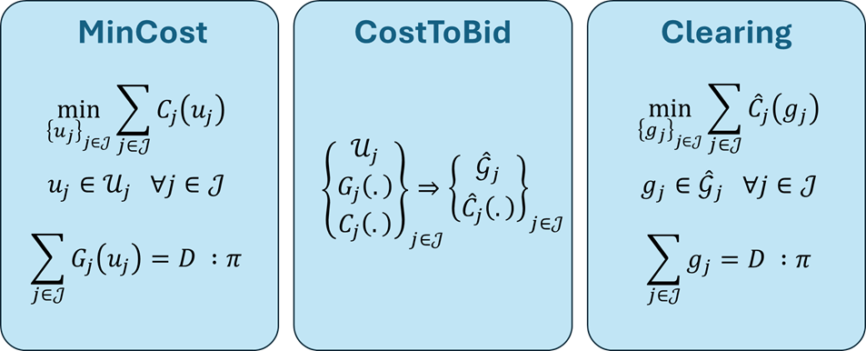
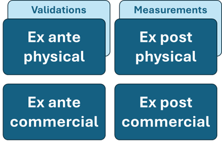

## Conceptual Overview

### 3.1 Bid-based VS Cost-based?

This section introduces the fundamental differences between bid-based and cost-based paradigms. In the Brazilian electric system, there are specific particularities that influence the strategic choices made in this package. One of the main challenges is evaluating the effect of decentralization (empowering decision-making agents) in electricity sectors with complex market rules.

### 3.2 Introducing the Key Modules and Submodules


- **Bid Initializer**: This module translates cost-based data into bid-based form as directly as possible. The set $\hat{\mathcal{G}}_{j}$ is defined based on the points $G_{j}(u_{j})$ for all $u_{j} \in \mathcal{U}_{j}$, and for the cost function, $\hat{C}_{j}(g) = c$ implies that there exists $u_{j} \in \mathcal{U}_{j}$ such that $g = G_{j}(u_{j})$ and $C_{j}(u_{j}) = c$.

- **Scenario Sampler**: Consider the differences between ex ante and ex post analysis.

### 3.3 A Simplified Mathematical Representation
#### 3.3.1 The Modules’ Core Mathematical Operation



We have two optimization problems with slightly different formats (MinCost and Clearing stages).

- **Input data:**
  - Exogenous net demand $D$
  - (MinCost) Data for each unit:
    - Cost functions $C_{j}$
    - Production functions $G_{j}$
    - Decision possibility sets $\mathcal{U}_{j}$
  - (Clearing) Data for each unit as seen by the planner:
    - Cost functions $\hat{C}_{j}$
    - Production possibility sets $\hat{\mathcal{G}}_{j}$

- **Output data:**
  - Dual variables $\pi$
  - (MinCost) Primal variables $u_{j}$
  - (Clearing) Primal variables $g_{j}$

This representation abstracts the different generation technologies: regardless of technology, units $j \in \mathcal{J}$ are synthesized for this representation by input data $\mathcal{U}_{j}$, $C_{j}$, $G_{j}$.

Note that every unit must have an owner, so we have $\bigcup_{a \in \mathcal{A}} \mathcal{J}_{a} = \mathcal{J}$ (where the set $\mathcal{J}_{a}$ indicates the units under the control of asset owner $a$).


 The role of the **CostToBid module** is to translate the input data from the MinCost representation to the expected data for the Clearing representation. It is important to note that only the input data in the MinCost representation are “physical” information in the database; the representations in the Clearing problem are created during the software execution.

Conceptually, the motivation for creating this differentiation (including a different notation) is that in a bid-based market (represented in the Clearing optimization problem), the central planner no longer directly influences the decisions $u_{j}$, which are private to the unit owner. However, unit production $g_{j} = G_{j}(u_{j})$ is observable by the operator and represents the main coupling point between the asset owners’ decisions that the operator needs to coordinate due to the constraint $\sum G_{j}(u_{j}) = D$. Thus, when moving from a centralized representation to a bid-based representation, the operator loses visibility over the variable $u_{j}$ but must maintain visibility over the variables $g_{j}$.

### 3.3.2 Caveats
Although the intuitive representation presented for the MinCost and Clearing optimization problems can be directly applied in simple applications, there are several additional complexities addressed as part of this project. In particular, we highlight:

- **Multi-zone and multi-hour problems:**
  - In practice, there is a balance equation (and therefore a demand value $D$ and a price result $\pi$) for each hour and each zone. The representation can be extended by adding variables, such as $\{\pi_{zh}\}$ for each zone and hour.
  - Transfers between zones (e.g., interconnections) or between hours (e.g., batteries) can be represented as additional physical variables (analogous to the $u_{j}$ variables) or as additional bids (analogous to the $g_{j}$ variables).
  
- **Constraints involving multiple units:**
  - The feasible region of each unit $u_{j}$ is not always isolated as $u_{j} \in \mathcal{U}_{j}$. Units can be interconnected, such as in a constraint like $u_{1} + u_{2} \leq 100$.
  - These joint constraints can be represented as $\{u_{j}\}$ for $j \in \mathcal{J}_{k}$ belonging to $\mathcal{U}_{k}$ (defining, for each joint constraint $k$, the set $\mathcal{J}_{k} \subset \mathcal{J}$ of units that comprise it, and the feasible region $\mathcal{U}_{k} \subseteq \prod_{j \in \mathcal{J}_{k}} \mathcal{U}_{j}$).

- **Stochastic problem:**
  - In its simplest version, stochasticity can be introduced by allowing parameters such as 𝒰_𝑗(𝜔) and 𝐷(𝜔) (among others) to vary with scenario 𝜔.
  - An additional consideration relates to uncertainty materializing after the asset owners' last opportunity to submit information (gate closure), which can be incorporated into the MinCost and Clearing submodules.

- **Multi-stage intertemporal problem:**
  - As mentioned earlier, a "multi-hour" problem representation can be used for some shorter-term temporal couplings, such as unit commitment or battery operation, typically normalized over a few hours.
  - However, this strategy is insufficient for some cases of interest. In Brazil, it is common for reservoir hydroelectric plants to consider the expected supply-demand balance up to 1 year (8760 hours) ahead or more.
  - Incorporating this aspect into the problem involves introducing state variables in a multi-stage problem, and we use the Stochastic Dual Dynamic Programming (SDDP) strategy in particular.

- **Additional components in the Clearing stage:**
  - Depending on market rules, the Clearing stage can be significantly more complex. More details can be found in this link.

### 3.4 Aspects of the Market Clearing Optimization Problem



- **Commercial elements:** Brazil is currently discussing the set of dispatch and pricing rules, so it is interesting to simulate different scenarios regarding, for example, bid submission formats and financial settlement rules.

Possible complexities **within** the optimization problem:
- Variables under the operator’s control:
  - Interchanges
  - Hydroelectric constraints / Hydro operation
  - Representation of strategic/centralized/price-taker units
- New constraints and dual variables:
  - Virtual reservoirs
  - Reserve products

### 3.5 Uncertainty Paradigm and the Cyclic Policy Graph
- **Motivation (e.g., hydropower):**
  - Ex ante vs. ex post (!)
  - State variable → ex ante (stochastic or deterministic) → ex post
  - ALWAYS represent 1 year (and without expansion)
  - Flexibility in the number of stages in the cycle/subcycle/cluster
  - Each stage is an optimization problem (whether MinCost or Clearing)
  
- **Physical elements:** The dynamics between renewable generation and hydroelectric generation are particularly relevant for the Brazilian case, especially involving resource randomness and the need for intertemporal reservoir management.

### 3.6 [LONG-TERM] Asset owners’ Strategies and Nash Equilibrium
A “natural” observation when studying the intuitive formulations presented earlier is that it would be possible to create a “mixed” representation of decision variables, i.e., representing some units under the central planner paradigm ($j \in \mathcal{J}_{C}$) and others under the centralized bid-based market paradigm ($j \in \mathcal{J}_{M}$).

In fact, this is a relevant representation, particularly when we want to evaluate the best strategy an asset owner $a_{0}$ can adopt in response to the strategies of other asset owners $a \neq a_{0}$, considering that they have full control over their units ($\mathcal{J}_{C} = \mathcal{J}_{a_{0}}$) but only information on the bid strategies $\hat{\mathcal{G}}_{j}$ and $\hat{C}_{j}$ of the other units ($\mathcal{J}_{M} = \mathcal{J} \setminus \mathcal{J}_{a_{0}}$).

The **CostToBid module** can take this asset owner’s optimization into account (considering the strategies of other asset owners) as part of the procedure to determine (or iteratively refine) the bid strategies $\hat{\mathcal{G}}_{j}$ and $\hat{C}_{j}$. However, the version of the software released in August 2024 does not yet include this functionality, although it is possible to run what-if tests for asset owners' bid strategies using the CostToBid module.

For the record, the mixed optimization problem representation in its “intuitive” form would be:

```math
\min_{\{u_{j} \in \mathcal{U}_{j}, g_{j} \in \hat{\mathcal{G}}_{j}\}} \sum_{j \in \mathcal{J}_{C}} C_{j}(u_{j}) + \sum_{j \in \mathcal{J}_{M}} \hat{C}_{j}(g_{j})
```

$$
\text{Subject to:}
$$

```math
u_{j} \in \mathcal{U}_{j}, \quad \forall j \in \mathcal{J}_{C}
```

```math
g_{j} \in \hat{\mathcal{G}}_{j}, \quad \forall j \in \mathcal{J}_{M}
```

```math
\sum_{j \in \mathcal{J}_{C}} G_{j}(u_{j}) + \sum_{j \in \mathcal{J}_{M}} g_{j} = D, \quad \text{with dual variable} \quad \pi
```


### 3.7 [LONG-TERM] Elements Influencing Asset owners' Revenue and Strategy
Asset owners use the aggregate expected revenue from the Clearing process to adjust their strategy (part of the CostToBid process), with mechanism design influencing these price signals.

Key elements **within the scope** of the system:
- Double settlement (vs. ex post only, vs. Brazil’s ex ante only model)
- Price caps and floors
- Pre-submission validation of bids

**Negotiable scope** (certainly not including everything, but probably including some aspects):
- Price formation without the network
- Contract component (limited by quantity?)
- Charge component (limited by zonal price or nodal dispatch?)

New integer variables? (fix vs. linearize vs. convex hull pricing)
- The first two are easier and planned.
- Convex hull is more complicated, especially if the model includes several possible integer variables.

Brazil is particularly challenging, with extremely complex contracts/charges, so it is unlikely that everything can be included.

- **Market structure elements:** Besides the updated information on which asset owners control different generating units in the Brazilian electric system, there is also the existence of the energy reallocation mechanism, which distributes ownership rights among hydroelectric plants in the system, and this needs to be considered in the model.